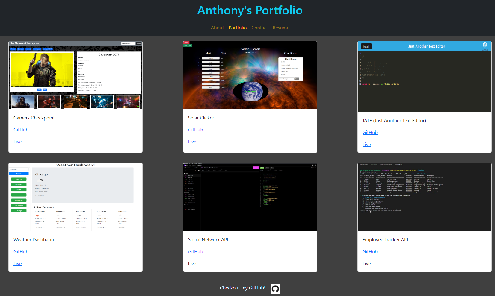

# React Portfolio

## Table of Content
* [Description](#description)
* [Visuals](#visuals)
* [Links](#links)
* [Support](#support)

## Description
  A react based portfolio I created. Right now it is mostly a template that I can use in the future to build a fully fleshed out portfolio for employers.

## Visuals

## Links
GitHub: https://github.com/SupernalDeity/react-portfolio

Heroku Live Site: 

## Suppport
Send any inquiries to perezant121@gmail.com.
